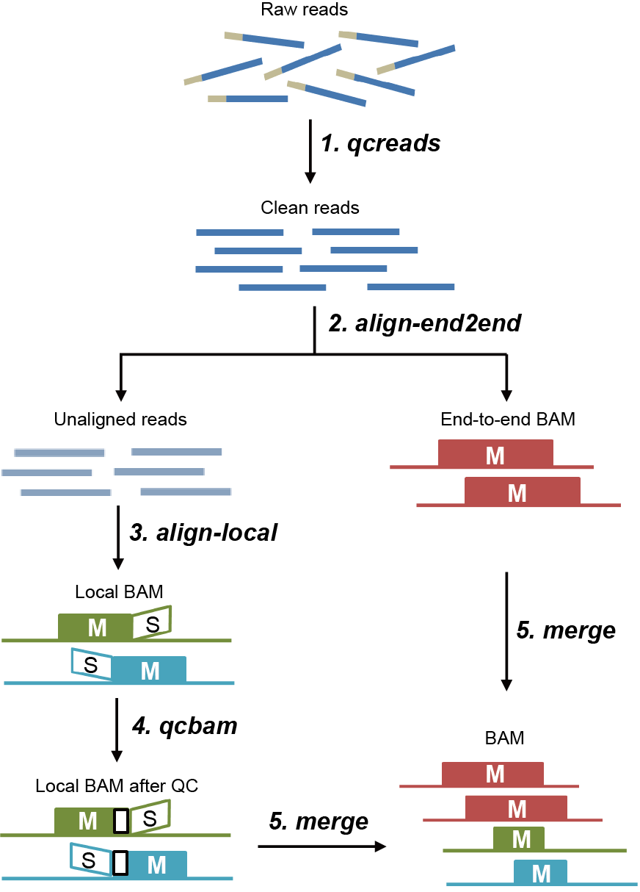

# scBS-map

- **Description**: Single-cell Bisulfite Sequencing Data Mapping


- **Version**: 1.0.0

- **System requirements**

  - Install [SAMtools](http://samtools.sourceforge.net/)
    - wget samtools-*.tar.bz2
    - tar -xjvf samtools-*.tar.bz2
    - cd samtools-*
    - ./configure --prefix=/install_path/
    - make
    - make install
    - export PATH=/samtools_install_path/:$PATH

  - Install [bowtie2](http://bowtie-bio.sourceforge.net/bowtie2/)
    - wget bowtie2-*.zip
    - unzip bowtie2-*.zip
    - export PATH=/bowtie2_install_path/:$PATH

  - Install [BS-Seeker2](http://pellegrini-legacy.mcdb.ucla.edu/bs_seeker2/)
    - wget BSseeker2*.zip
    - unzip BSseeker2*.zip
    - export PATH=/BSseeker2_install_path/:$PATH

- **Usage**: `perl scBS-map.pl [options] [-f <.fastq>] [-g <genome.fa>] [-o <out.bam>]`

    ```
    -l    Length of trimming bases from the 5' end of the read [default: 10].
    -p    Number of threads. [default: 12].
    -s    Path to samtools eg. /home/user/bin/samtools
          - By default, we try to search samtools in system PATH.
    -a    Path to bs_seeker2-align eg. /home/user/bin/bs_seeker2-align.py
          - By default, we try to search bs_seeker2-ailgn in system PATH.
    -b    Path to bs_seeker2-build eg. /home/user/bin/bs_seeker2-build.py
          - By default, we try to search bs_seeker2-build in system PATH.
    -w    Logical to determine if the genome index needs to be built or not [default: FALSE].
    -n    Length of removing microhomology regions from bam files [default: 10].
    -f    File name for sequencing reads, .fastq format.
          - a compressed file (.fastq.gz) is also supported.
    -g    Genome file name, fasta format.
    -o    Output file name, bam format.
    -h    Help message.
    ```

- **Example**: perl scBS-map.pl -l 9 -p 40 -n 10 -f Sample1.R1.fastq.gz -g hg38.fa -o Sample1.R1.bam

- **Output files**:

  - **.end2end.bam**:         Output file by end-to-end mode, .bam format.

  - **.local.bam**:           Output file by local mode, .bam format.

  - **.unaligned.fq**:        Unaligned reads, .fq format.

  - **.multihits.fq**:        Multiple-hits reads, .fq format.

  - **.out.bam**:             Final alignment file, .bam format

  - **.scBS-map.report**:     Report for the alignment results.
    ```
    --------------------------------------------------
    scBS-map report for test sample
    --------------------------------------------------
    Number of reads: 10000
    Number of bases: 1312217
    Number of reads after quality control: 9852
    Number of bases after quality control: 1219137

    Number of mapped reads using the end-to-end mode: 2827
    Number of mapped bases using the end-to-end mode: 356285

    Number of mapped reads using the local mode: 1427
    Number of mapped bases using the local mode: 98277

    Number of unmapped reads: 1341
    Number of multi-hits reads: 910

    Number of mapped reads in total: 4254
    Mappability in total: 42.54%

    Number of mapped bases in total: 454562
    Mappability at base level in total: 34.64%
    --------------------------------------------------
    ```
    
- **Subcommands**:

  1. **qcreads**:
  
      - **Description**: Trim low quality sequences.

      - **Usage**: `perl qcreads.pl [-f <.fastq>] [-l length] [-o output]`

          ```
          -f FILE               File name for sequencing data, fastq format.
          -l INT                Length of removed bases from the 5' end of the read [default: 10].
          -o OUTFILE            Output file name, .fastq.gz format.
          ```

      - **Example**: perl qcreads.pl -f Sample.R1.fastq.gz -l 10 -o Sample.R1.trim.fastq.gz

  2. **align-end2end**:   
  
      - **Description**: Perform end-to-end alignment on clean reads.

      - **Usage**: `perl align-end2end.pl [-f input<.fastq>] [-g genome<.fa>] [-p threads] [-u unmappedreads] [-o output]`

          ```
          -f FILE               File name for clean data, fastq format.
          -g FILE               Genome file name, fasta format.
          -p INT                Number of launching threads [default: 12].
          -u OUTFILE            File name for unmapped reads if needed.
          -o OUTFILE            Output file name, bam format.
          ```

      - **Example**: perl align-end2end.pl -f Sample.R1.trim.fastq.gz -g hg38.genome.fa -p 40 -u Sample.R1.unmapped.bam -o Sample.R1.end2end.bam

  3. **align-local**:
  
      - **Description**: Perform local alignment on clean reads.

      - **Usage**: `perl align-local.pl [-f input<.fastq>] [-g genome<.fa>] [-p threads] [-o output]`

          ```
          -f FILE               File name for clean data, fastq format.
          -g FILE               Genome file name, fasta format.
          -p INT                Number of launching threads [default: 12].
          -o OUTFILE            Output file name, bam format.
          ```

      - **Example**: perl align-local.pl -f Sample.R1.clean.fastq.gz -g hg38.genome.fa -p 40 -o Sample.R1.local.bam

  4. **qcbam**:
  
      - **Description**: Remove the low confidence alignments within microhomology regions

      - **Usage**: `perl qcbam.pl [-f <in.bam>] [-n number] [-p threads] [-o <out.bam>]`

          ```
          -f FILE               File name for local alignment, bam format.
          -n INT                Number of trimming bases [default: 10]
          -p INT                Number of launching threads [default: 12].
          -o OUTFILE            Output file name, bam format.
          ```

      - **Example**: perl qcbam.pl -f Sample.R1.local.bam -n 10 -o Sample.R1.local.hc.bam

  5. **mergebam**:
  
      - **Description**: Merge alignments from end-to-end and local mapping if available

      - **Usage**: `perl mergebam.pl [-e <.end2end.bam>] [-l <.local.bam>] [-p threads] [-o output]`

          ```
          -e FILE               File name of end2end alignment, .bam format.
          -l FILE               File name of local alignment, .bam format.
          -p INT                Number of launching threads [default: 12].
          -o OUTFILE            Output file name, bam format.
          ```

      - **Example**: perl mergebam.pl -e Sample.R1.end2end.bam -l Sample.R1.local.hc.bam -p 40 -o Sample.R1.merge.bam

- **Authors**:

    Peng Wu; wupeng1@ihcams.ac.cn
